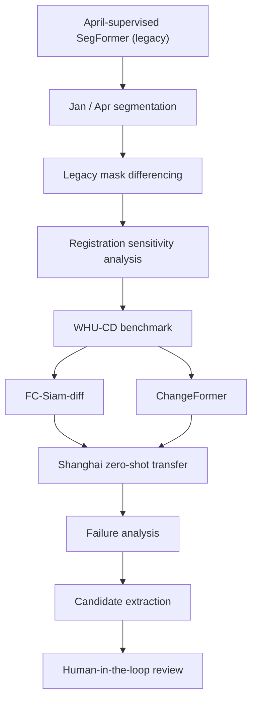
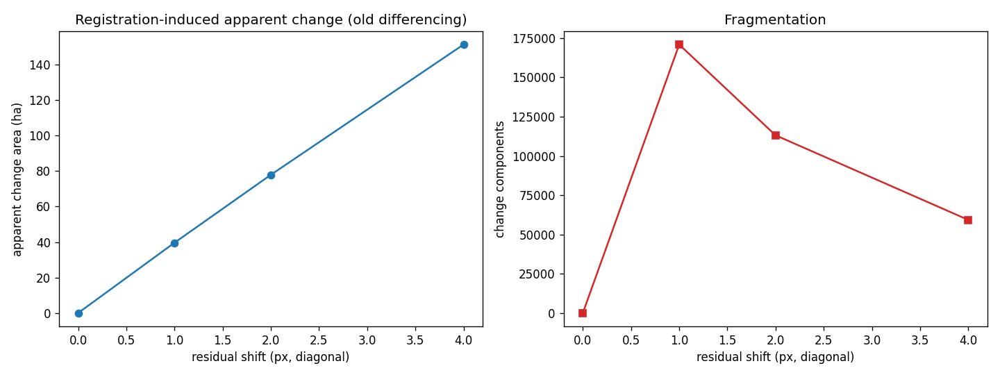
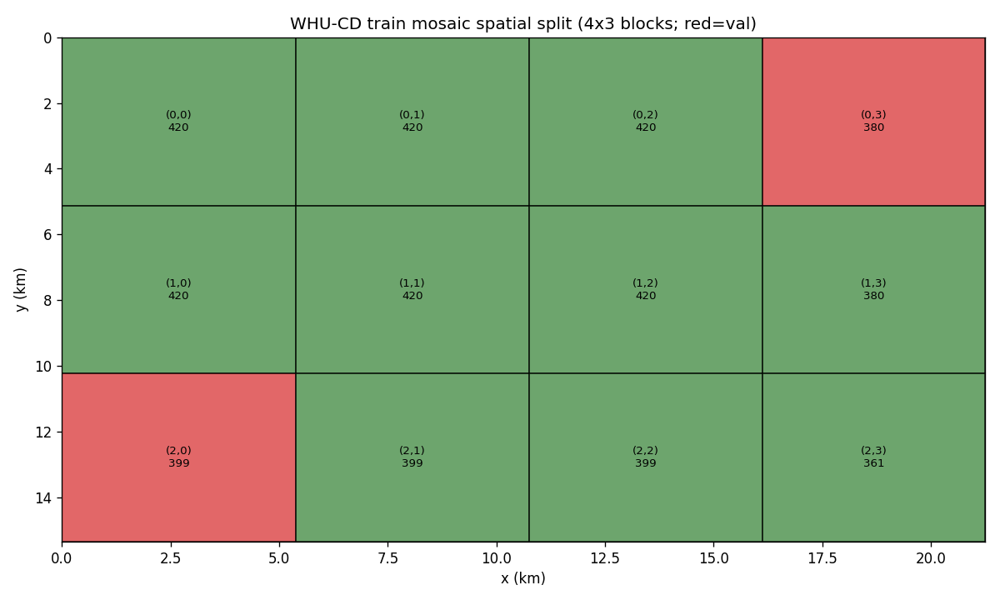
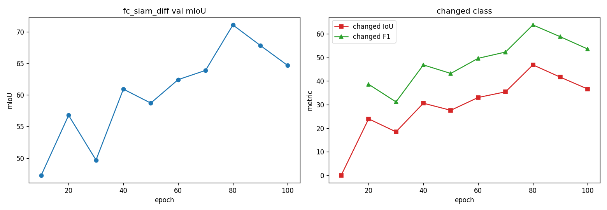
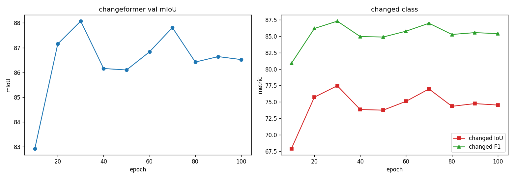

# GeoBuild-CD

**Rural Building Change Detection under Domain Shift**

> This research project tests whether direct bi-temporal change detection can
> replace registration-sensitive segmentation differencing for screening rural
> building change candidates in high-resolution imagery. A benchmark (WHU-CD)
> confirms ChangeFormer is the stronger direct-CD model, and a zero-shot
> transfer to rural Shanghai shows why benchmark performance does not
> automatically become reliable operational screening.

**Status:** Research prototype complete; local supervised adaptation and
exhaustive local validation are deferred to future work.

- **Predecessor:** [Shanghai Rural Building Segmentation](https://github.com/raccoon663/shanghai-rural-building-segmentation)
- **Data access:** local high-resolution Shanghai imagery is not redistributed
  (see [docs/data_and_splits.md](docs/data_and_splits.md)).



## Key Findings

1. **Registration error can dominate segmentation differencing.** A 1–2 px
   residual shift alone produces tens of hectares of apparent change.
2. **ChangeFormer performs strongly on WHU-CD.** Changed F1 91.64 / IoU 84.58
   on the official test mosaic — well ahead of the FC-Siam-diff direct-CD
   baseline (F1 70.77).
3. **WHU benchmark performance does not transfer cleanly to rural Shanghai.**
   Zero-shot inspection shows seasonal/radiometric false positives, missed
   small changes, and strong threshold/domain sensitivity.
4. **Human-in-the-loop screening is a more realistic operational endpoint**
   than fully automated decisions for this sparse, high-resolution setting.

## What Worked

- Spatially separated WHU-CD benchmark (no random patch split; see
  `figures/whu_spatial_split.png`).
- ChangeFormer clearly stronger than FC-Siam-diff on WHU-CD.
- Registration sensitivity quantitatively explains why the legacy
  segmentation-differencing workflow produces unreliable change maps.
- Direct CD reduces boundary-fragment style pseudo-change on Shanghai.
- Candidate ranking + review-card workflow implemented and QA'd as a
  prototype.

## What Did Not Yet Work

- Zero-shot Shanghai predictions are not sufficiently reliable for automated
  decisions.
- Visually unchanged areas can still receive high change probability
  (seasonal / radiometric / land-cover effects).
- Some visually apparent small changes are missed.
- The candidate ranking has not been systematically human-validated.
- No exhaustive Shanghai change ground truth exists.

## Research Progression

```text
Previous project:
single-date building segmentation
        ↓
Problem discovered:
mask differencing is registration-sensitive
        ↓
This project:
direct bi-temporal change detection
        ↓
New problem discovered:
strong benchmark performance ≠ reliable cross-domain transfer
        ↓
Practical endpoint:
human-in-the-loop candidate screening
```

## Motivation

The original workflow segmented each date independently and differenced the
masks:

```text
T1 → SegFormer → building mask ─┐
                                ├─→ mask differencing → "change"
T2 → SegFormer → building mask ─┘
```

Experiments showed that **segmentation errors plus 1–2 px registration
residuals generate large amounts of pseudo-change**. The project therefore
moved to direct bi-temporal change detection (T1+T2 → ChangeFormer →
candidate objects → risk ranking → human review), keeping the segmentation
model only as a legacy baseline.

### Why segmentation differencing failed

Controlled mask-shift experiments (aligned building mask shifted by k px, then
XORed) quantify how much "change" pure misregistration creates:

| Residual shift | Apparent change (ha) |
| -------------: | -------------------: |
| 0 px           | 0.00                 |
| 1 px           | ~39.6                |
| 2 px           | ~77.9                |
| 4 px           | ~151.3               |



> Residual registration error alone can create large apparent change areas in
> independent segmentation differencing. These are apparent (pseudo) changes,
> not measured real change — see [reports/registration_sensitivity.md](reports/registration_sensitivity.md).

## WHU-CD Benchmark

WHU-CD was tiled on a global 256 px grid; the training mosaic was partitioned
into a **4×3 spatial block grid** with **val = blocks (0,3) and (2,0)**. No
random patch split.



> Spatially separated validation; no random patch split.

On the WHU-CD benchmark, **ChangeFormer substantially outperformed the
FC-Siam-diff direct-CD baseline** (official test mosaic):

| Model        | Changed F1 | Changed IoU | Precision | Recall |
| ------------ | ---------: | ----------: | --------: | -----: |
| FC-Siam-diff |      70.77 |       54.77 |     59.72 |  86.84 |
| ChangeFormer |      91.64 |       84.58 |     94.99 |  88.52 |

| FC-Siam-diff (val) | ChangeFormer (val) |
| --- | --- |
|  |  |

> The legacy segmentation-differencing workflow is compared structurally on
> Shanghai, where no clean local change GT is available; no cross-method
> Shanghai accuracy claim is made.

Details: [reports/whu_fcsn_results.md](reports/whu_fcsn_results.md) and
[reports/whu_changeformer_results.md](reports/whu_changeformer_results.md).

## Cross-Domain Transfer to Rural Shanghai

The WHU-trained models were applied zero-shot to a January–April pair in rural
Shanghai (April resampled onto the January grid; no local labels used).
This is a **zero-shot diagnostic**, not a local accuracy estimate:

- ChangeFormer predicted change ≈ 0.9–1.1% of valid content;
- FC-Siam-diff predicted change ≈ 20.2% of valid content.

Qualitative inspection exposed substantial domain-shift effects:

- seasonal / radiometric false positives;
- non-building appearance changes flagged as change;
- missed small true building changes;
- strong threshold and architecture sensitivity.

**Headline conclusion:** benchmark performance did not directly translate into
reliable cross-domain rural change screening. No Shanghai precision / recall
is claimed. See [reports/pre_gt_failure_analysis.md](reports/pre_gt_failure_analysis.md).

## Human-in-the-loop Screening Prototype

Because no verified Shanghai change GT exists, the project implements a
candidate-screening **prototype**: objects extracted from the ChangeFormer
change probability, risk-aware ranking
([configs/candidate_ranking.yaml](configs/candidate_ranking.yaml)), and
top-K review cards for human verification.

The zero-shot map was converted into **5,579 candidate objects**, from which a
**295-object stratified review pool** was constructed to demonstrate the
review workflow; **candidate count does not imply correctness**, and systematic
annotation was intentionally deferred. See
[reports/HUMAN_REVIEW_GATE.md](reports/HUMAN_REVIEW_GATE.md).

## Headline Results

| Experiment               | Metric                  |   Result |
| ------------------------ | ----------------------- | -------: |
| Registration sensitivity | Apparent change at 1 px | ~39.6 ha |
| Registration sensitivity | Apparent change at 2 px | ~77.9 ha |
| FC-Siam-diff / WHU-CD    | Changed F1              |    70.77 |
| ChangeFormer / WHU-CD    | Changed F1              |    91.64 |
| ChangeFormer / WHU-CD    | Changed IoU             |    84.58 |

Shanghai is reported only as a **zero-shot diagnostic** (see above), never in
the same accuracy table as the benchmark.

## Repository Structure

```text
configs/     candidate ranking + OpenCD training configs (ChangeFormer, FC-Siam-diff)
src/         pure-PyTorch SegFormer-B5 legacy baseline + tiled inference
scripts/     WHU-CD prep, training launcher, zero-shot inference, ranking, review cards
reports/     curated results and the human-review gate
docs/        methodology, model provenance, data/splits, limitations, future work
figures/     all figures embedded in this README
sample_outputs/  output schema documentation (no data)
environment/ environment notes (base runtime vs OpenCD training runtime)
```

## Reproduction

Three entry points. Configure the placeholders documented in
[docs/data_and_splits.md](docs/data_and_splits.md) first, and see
[environment/README.md](environment/README.md) for the two runtimes.

### A. Prepare WHU-CD

```bash
python scripts/whu_cd_audit.py       # read-only audit of the official download
python scripts/whu_cd_prepare.py     # tiling + spatially separated split
```

### B. Train the public benchmark models

```bash
# using the OpenCD environment python (Environment B)
<OPENCD_VENV_PYTHON> scripts/opencd_train_local.py --config configs/fcsn/fc_siam_diff_256x256_100e_whucd.py
<OPENCD_VENV_PYTHON> scripts/opencd_train_local.py --config configs/changeformer/changeformer_mit-b0_256x256_100e_whucd.py
```

### C. Run custom bi-temporal inference

```bash
python scripts/opencd_zero_shot_shanghai.py \
    --t1 /path/to/t1.tif --t2 /path/to/t2.tif \
    --config <opencd_cfg> --checkpoint <pth> --output <out_dir>
```

## Limitations

The full list lives in [docs/limitations.md](docs/limitations.md). The
short version: no clean Shanghai change GT, zero-shot ≠ local accuracy,
seasonal/radiometric confounders, possible missed small changes, residual
registration error, and a screening system that requires human verification.

## Future Work

Deferred to a future phase (not part of this frozen prototype): a small,
exhaustively reviewed Shanghai benchmark; hard negatives from seasonal false
positives; limited local fine-tuning of ChangeFormer; label-efficiency and
small-change recall studies; Precision@K validation; a better review
interface. See [docs/future_work.md](docs/future_work.md).

## License & Attribution

Original code in this repository is available under the
[Apache License 2.0](LICENSE). Third-party projects, pretrained weights, and
dataset sources are attributed in [THIRD_PARTY_NOTICES.md](THIRD_PARTY_NOTICES.md).
WHU-CD and the local Shanghai imagery are not redistributed.

---

**Status:** This repository is frozen as a research prototype demonstrating
the progression from segmentation differencing to direct change detection and
cross-domain failure analysis. Local supervised adaptation and exhaustive
Shanghai validation are reserved for a future phase.
