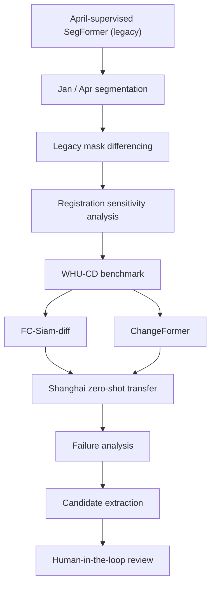

# GeoBuild-CD

**Rural Building Change Detection under Domain Shift**

> A research-oriented workflow for detecting and ranking sparse rural building-change
> candidates from high-resolution bi-temporal imagery, with explicit analysis of
> registration error, cross-domain transfer, and human verification.

**Project status:** Research prototype complete. Paused before local supervised
adaptation and exhaustive human validation.

- **Previous project:** [Shanghai Rural Building Segmentation](https://github.com/raccoon663/shanghai-rural-building-segmentation)
  — single-date building segmentation with SegFormer. This repository does not modify it.
- **Data access:** Local high-resolution Shanghai imagery is **not redistributed**
  due to data-access restrictions. See [docs/data_and_splits.md](docs/data_and_splits.md).

---

## Motivation

The earlier workflow produced building maps by segmenting each date independently
and then differencing the masks:

```text
T1 → SegFormer → building mask ─┐
                                ├─→ mask differencing → "change"
T2 → SegFormer → building mask ─┘
```

Experiments showed that **segmentation errors plus 1–2 px registration residuals
generate large amounts of pseudo-change** — enough to dominate the differencing
output. This project therefore upgrades the pipeline to direct bi-temporal change
detection:

```text
T1 + T2
   ↓
direct bi-temporal CD
   ↓
ChangeFormer
   ↓
candidate objects
   ↓
risk ranking
   ↓
human review
```

> This project grew out of an earlier rural-building segmentation workflow. The
> segmentation model is retained here as a legacy baseline, while the main research
> question shifts from building extraction to reliable bi-temporal change screening.

The scope is deliberately framed around **candidate screening**, not automatic
detection: outputs are *building-change candidates* / *suspected change* that are
ranked for **human verification** (human-in-the-loop), because high-resolution
sub-meter imagery without a validated local benchmark does not yet support
unsupervised claims of "confirmed" change.

---

## Workflow



Phases are documented in [reports/](reports/) and summarized in
[docs/methodology.md](docs/methodology.md).

---

## Key Findings

### 1. Why segmentation differencing failed

Simulated residual registration shifts applied to aligned building masks produce
large **apparent** change before any real change is considered:

| Residual shift | Apparent change (ha) |
| -------------: | -------------------: |
| 0 px           | 0.00                 |
| 1 px           | ~39.6                |
| 2 px           | ~77.9                |
| 4 px           | ~151.3               |

> Small spatial misregistration can dominate segmentation-differencing outputs.

These are **apparent** changes (pseudo-change), not measured real change. Full
analysis in [reports/registration_sensitivity.md](reports/registration_sensitivity.md)
and `figures/registration_sensitivity.png`.

### 2. Direct CD on WHU-CD

Direct bi-temporal models trained on WHU-CD (spatially separated train/val/test)
reach substantially higher change-class accuracy than the differencing baseline:

| Model        | Changed F1 | Changed IoU | Precision | Recall |
| ------------ | ---------: | ----------: | --------: | -----: |
| FC-Siam-diff |      70.77 |       54.77 |     59.72 |  86.84 |
| ChangeFormer |      91.64 |       84.58 |     94.99 |  88.52 |

> Results are evaluated on the WHU-CD official test mosaic after spatially
> separated training/validation preparation.

These are **WHU-CD benchmark** numbers, not Shanghai accuracy. Details in
[reports/whu_fcsn_results.md](reports/whu_fcsn_results.md) and
[reports/whu_changeformer_results.md](reports/whu_changeformer_results.md).

### 3. Zero-shot transfer to rural Shanghai

The WHU-trained models were applied zero-shot to the Shanghai Jan–Apr pair
(April resampled onto the January grid, no local supervision):

- **ChangeFormer:** predicted change ≈ **0.9–1.1%** of valid content
- **FC-Siam-diff:** predicted change ≈ **20.2%** of valid content

Qualitative inspection revealed substantial domain-shift effects, including
seasonal/radiometric false positives and missed small changes. Consequently:

> High benchmark performance did not directly translate into reliable operational
> change detection in Shanghai.

This is the central negative result of the project: zero-shot cross-domain transfer
(Christchurch → rural Shanghai, winter → spring) is strongly model- and
threshold-dependent, and any recalibration must wait for a clean local benchmark.

### 4. Human-in-the-loop screening

Because no verified Shanghai change ground truth exists yet (GT Gate), the project
implements a **candidate screening prototype**: object-level extraction from the
ChangeFormer change probability, transparent risk-aware ranking
([configs/candidate_ranking.yaml](configs/candidate_ranking.yaml)), and
top-K review cards for human verification. The workflow is implemented; the
human review itself is a prototype stage, not an operational validation.
See [reports/HUMAN_REVIEW_GATE.md](reports/HUMAN_REVIEW_GATE.md).

---

## Methods

- **Legacy segmentation baseline** — SegFormer-B5 (pure-PyTorch, no mmcv/mmseg),
  supervised on April building labels (`src/segmentation/`). Two variants are
  retained for comparison:
  - *local model* (iter-6000): April + hard negatives + shadow samples;
  - *original app model* (iter-14000): WHU-generalized finetune shipped with the
    packaged change-detection application.
  Full provenance in [docs/model_provenance.md](docs/model_provenance.md).
- **Direct change detection (OpenCD)** — FC-Siam-diff and ChangeFormer (mit-b0)
  trained on a WHU-CD-256 build with **spatially separated** train/val/test
  (no random patch split), see [docs/data_and_splits.md](docs/data_and_splits.md)
  and `configs/`.
- **Zero-shot inference** — WHU-trained checkpoints applied to the Shanghai
  Jan–Apr pair; April is resampled onto the January grid before inference.
- **Registration analysis** — ECC / phase-correlation offset estimation across
  months, plus controlled mask-shift experiments to quantify registration-driven
  pseudo-change.
- **Candidate pipeline** — probability → objects → size groups → risk features
  (boundary distance, building context, multi-model agreement, spectral proxy)
  → transparent ranking → review-card generation.

## Results

| Result | Value | Reference |
| ------ | ----- | --------- |
| Registration pseudo-change (1 / 2 / 4 px) | ~39.6 / 77.9 / 151.3 ha | `reports/registration_sensitivity.md` |
| WHU-CD test — ChangeFormer changed F1 / IoU | 91.64 / 84.58 | `reports/whu_changeformer_results.md` |
| WHU-CD test — FC-Siam-diff changed F1 / IoU | 70.77 / 54.77 | `reports/whu_fcsn_results.md` |
| Shanghai zero-shot change fraction | CF ~0.9–1.1% / FC ~20.2% | `reports/pre_gt_failure_analysis.md` |
| ChangeFormer review candidates | 5,579 objects | `reports/HUMAN_REVIEW_GATE.md` |

## Failure Analysis

Before any Shanghai accuracy metric is allowed (GT Gate), the old-differencing vs
direct-CD comparison is structural and qualitative
([reports/pre_gt_failure_analysis.md](reports/pre_gt_failure_analysis.md)):

- ChangeFormer zero-shot change area is in the same order of magnitude as the
  filtered old baseline (≈68 ha vs ≈87 ha) yet their **overlap is very low**
  (IoU ≈ 0.02): the two methods flag largely different regions.
- Direct CD has far lower boundary-edge share (1.3–2.9% vs 10.5%), consistent
  with better suppression of registration-edge artifacts.
- **FC-Siam overpredicts** on the zero-shot transfer (~20.2% change fraction),
  making it unsuitable as the primary screening model without recalibration.
- OpenCD direct CD outputs are binary change maps (no gain/loss direction);
  gain/loss splitting does not apply to them.

## Repository Structure

```text
GeoBuild-CD/
│
├── README.md
├── .gitignore
├── requirements.txt
│
├── configs/
│   ├── project.yaml                  # paths/hyper-parameters (placeholders)
│   ├── candidate_ranking.yaml        # transparent ranking weights
│   ├── changeformer/                 # ChangeFormer WHU-CD training config
│   └── fcsn/                         # FC-Siam-diff WHU-CD training config
│
├── src/
│   └── segmentation/                 # pure-PyTorch SegFormer-B5 + inference
│
├── scripts/                          # dataset prep, training, inference,
│                                     # ranking, review-card generation
├── docs/
│   ├── methodology.md
│   ├── model_provenance.md
│   ├── data_and_splits.md
│   ├── limitations.md
│   └── future_work.md
│
├── figures/
│   ├── registration_sensitivity.png
│   ├── changeformer_whu_val_curves.png
│   ├── fc_siam_diff_whu_val_curves.png
│   └── whu_spatial_split.png
│
├── sample_outputs/                   # schema documentation only (no data)
│
└── reports/
    ├── registration_sensitivity.md
    ├── whu_data_audit.md
    ├── whu_spatial_split.md
    ├── whu_fcsn_results.md
    ├── whu_changeformer_results.md
    ├── pre_gt_failure_analysis.md
    └── HUMAN_REVIEW_GATE.md
```

## Reproduction

All local paths are placeholders; replace them before running.

**Environment setup**

```bash
python -m pip install -r requirements.txt
```

The direct-CD training/inference additionally requires an OpenCD environment
(mmgengine / mmcv / mmseg + `pip install -e <path-to-OpenCD>`). OpenCD is an
external dependency — see the [upstream project](https://github.com/likyoo/open-cd)
for install instructions; this repository only ships the run configs and glue
scripts. The `src/segmentation/` legacy baseline is pure PyTorch and needs no
mmcv/mmseg.

**WHU-CD preparation**

Download WHU-CD from the official dataset source, then:

```bash
python scripts/whu_cd_audit.py          # read-only audit of the raw download
python scripts/whu_cd_prepare.py        # tiling + spatially separated split
```

**FC-Siam training / ChangeFormer training**

```bash
# using the OpenCD venv python
<OPENCD_VENV_PYTHON> scripts/opencd_train_local.py --config configs/fcsn/fc_siam_diff_256x256_100e_whucd.py
<OPENCD_VENV_PYTHON> scripts/opencd_train_local.py --config configs/changeformer/changeformer_mit-b0_256x256_100e_whucd.py
```

**Shanghai inference interface**

```bash
python scripts/opencd_zero_shot_shanghai.py \
    --config <opencd_cfg> --checkpoint <pth> --tag changeformer
```

Configure `<LOCAL_SHANGHAI_DATA>/2026-01.tif` and `/2026-04.tif` (the Jan–Apr
pair) inside the script first.

**Candidate extraction**

```bash
python scripts/build_review_candidates.py     # objects from change probability
python scripts/rank_and_review.py             # risk ranking + review cards
python scripts/build_review_manifest_xlsx.py  # human-review spreadsheet
python scripts/review_card_qa.py              # card quality checks
```

## Limitations

1. January / April building annotations follow different polygonization
   conventions and cannot be directly XORed into a clean local change GT.
2. No exhaustive, independently verified Shanghai change benchmark is currently
   available.
3. Shanghai results are zero-shot transfer observations, not local accuracy
   estimates.
4. Seasonal, radiometric, vegetation, and land-cover differences can produce
   high change probabilities.
5. Small true building changes may still be missed.
6. Residual registration errors remain relevant at sub-meter / pixel scale.
7. The candidate-ranking system is intended for human screening rather than
   fully automated decisions.

## Future Work

- Build a small, exhaustively reviewed Shanghai benchmark.
- Collect hard negatives from seasonal false positives.
- Fine-tune ChangeFormer with limited local supervision.
- Evaluate label efficiency under 50 / 100 / 200 / 500 local patches.
- Measure small-change recall on an independent held-out AOI.
- Validate Precision@K and candidate-ranking efficiency.
- Improve the human-review interface.

> Local adaptation is intentionally left as a future phase rather than being
> performed on the current review candidates.

---

## Data & Third-Party Attribution

- **WHU-CD** is not redistributed here; download it from the official dataset
  source and configure its local path. This repository contains only dataset
  preparation, spatial splitting, and OpenCD run configs.
- **Shanghai high-resolution imagery and derived local data** are not
  redistributed due to data-access restrictions; the repository uses schematic
  figures, metric plots, and placeholders instead.
- **OpenCD / mmseg / mmengine** are third-party projects used as dependencies
  with their respective licenses; this repository references them upstream and
  does not vendor their code.
